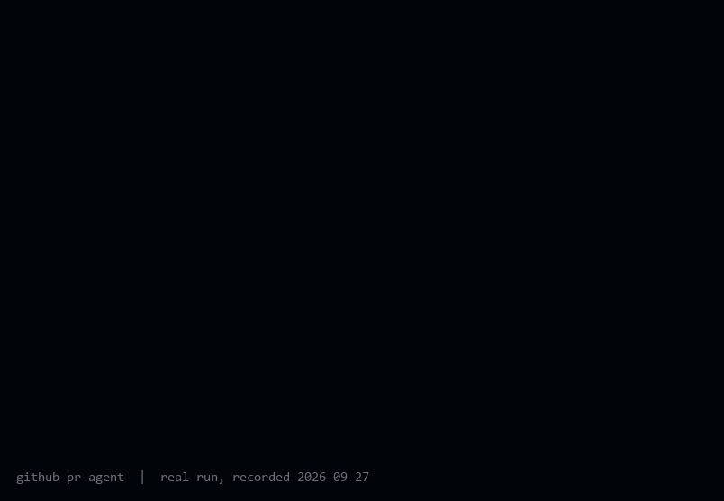

# GitHub PR Agent

> Renamed 2026-09-27: the Python package was `autocto` and is now `github_pr_agent` (CLI `github-pr-agent`), so it no longer collides with [repo-autocto](https://github.com/zaidwhy/autocto), which installs a package and command of the same old name. Settings still read the `AUTOCTO_` prefix.

[](https://github.com/zaidwhy/github-pr-agent/actions/workflows/ci.yml)


[](LICENSE)

**The AI Staff Engineer every repository deserves.** Project #3 in a larger local-first
AI ecosystem built on the [Personal LLM](https://github.com/zaidwhy/personal-llm) core.

This repo is the **engineering-manager layer**: it understands a repository, reports on its
health, triages its issues, and drafts a pull-request plan. It deliberately does **not** write
the code. On the free/local model the ecosystem uses, analysis and planning are reliable while
code generation is not - so implementation is handed to the **`/github-pr` Claude Code skill**,
which does the real PR work (write the fix, run tests, open the PR after your approval).

Its pattern is proven: the manager layer triaged a real issue, the implementer skill
wrote the fix, and the resulting PR ([#2](https://github.com/zaidwhy/github-pr-agent/pull/2),
a hardening pass with the full 32-test suite) was reviewed and merged.

## What it does

- **`analyze`** - summarize a local repo: languages, dependency manifests, layout.
- **`triage`** - pull open issues via the GitHub CLI and rank the best first-issue candidates.
- **`report`** - a markdown engineering report (health checklist + a deterministic benchmark
  scorecard + languages + optional triage + a short model-written assessment).
- **`plan`** - draft a PR implementation plan for one issue: the handoff artifact for `/github-pr`.

Triage/report/plan reuse the authenticated `gh` CLI for GitHub data and the free Personal LLM
router (Gemini free tier or local Ollama) only for the prose. No new API keys.

## Setup (under 5 minutes)

Clone this repo and the core side by side, then install both:

```powershell
git clone https://github.com/zaidwhy/personal-llm
git clone https://github.com/zaidwhy/github-pr-agent
cd github-pr-agent
py -3.12 -m venv venv
& "venv\Scripts\python" -m pip install -r requirements.txt

# Personal LLM core (for the prose commentary). Its runtime deps live in its requirements.txt.
& "venv\Scripts\python" -m pip install -r ..\personal-llm\requirements.txt
& "venv\Scripts\python" -m pip install -e ..\personal-llm
& "venv\Scripts\python" -m pip install -e .

# The `gh` CLI must be installed and authenticated for triage/plan:
gh auth status
```

## Use

```powershell
# Analyze any local repo
& "venv\Scripts\python" -m github_pr_agent.interfaces.cli analyze ..\second-brain

# Triage issues on any GitHub repo (best first-issue candidates first)
& "venv\Scripts\python" -m github_pr_agent.interfaces.cli triage zaidwhy/second-brain --label "good first issue"

# Full engineering report (local analysis + remote triage)
& "venv\Scripts\python" -m github_pr_agent.interfaces.cli report ..\second-brain --repo zaidwhy/second-brain --out data\report.md

# Draft a PR plan for one issue, then hand it to /github-pr to implement
& "venv\Scripts\python" -m github_pr_agent.interfaces.cli plan zaidwhy/second-brain 12 --path ..\second-brain --out data\pr-plan.md
```

## How it pairs with the skill

The agent's CLI produces the plan; the `/github-pr` skill executes it. You can run either alone:
`/github-pr` can find and fix an issue on its own, and the CLI can report/triage without ever
opening a PR. Together, the CLI scopes the work and the skill does it.

## Tests

```powershell
& "venv\Scripts\python" -m pytest tests/ -q
```

43 tests (1 additional test skips gracefully if the sibling `personal_llm` core isn't
installed alongside this repo). The logic modules (`repo`, `issues`, `report`, `plan`,
`github`) take injected callables and fake data - no `gh`, network, or model needed - so
the suite runs fully offline (CI runs it keyless on every push). Only the CLI touches
`gh` and Personal LLM, and it imports them lazily. Hardened invariants: every `gh`
failure becomes a readable `GhError` (exit 1, no traceback), the LLM degrades to a stub
if the core is missing, and repo scanning is deterministic.

## Demo



Recorded 2026-09-27 from a real run: `analyze` on a checkout of jd/tenacity, then `triage`
against its live issues (#644 is de-ranked because its latest comment is a soft claim). The
output is the program's own; only the typing speed is rendered.

<!-- TODO(zaid): add the `plan` half once plans are grounded in a real file listing. The
2026-09-27 run on tenacity#534 named files that do not exist (see MASTER_LOG). -->

## Contributing

Small, focused PRs welcome - see [CONTRIBUTING.md](CONTRIBUTING.md) for the ground
rules (the short version: tests stay offline and keyless, inject fakes, `gh` and
`personal_llm` imports stay lazy in the CLI only). Bug and feature issue templates are
under `.github/ISSUE_TEMPLATE/`.

## License

[MIT](LICENSE).
